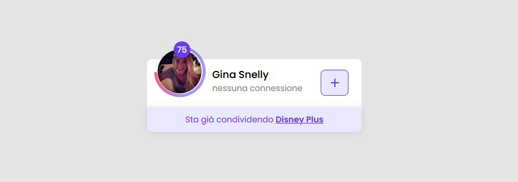

# Together Price - SearchContactCard Component
 A React component written in Typescript for Together Price (Italy) 

 ### Preview 
 

 ### Walkthrough of Process
 1. Created a color palette from the Figma designs in the *`App.css` file*
 ```sh
:root{
  --app-back-color: #e5e5e5;
  --app-fore-color: #ffffff;
  --app-theme-color: #6a3eea;
  --app-soft-theme-color: #eae8fe;
}
```

2. Imported `Poppins` Font choosing weights: *`400, 500 and 600`* from Google Fonts in the *`index.css` file line 1*
```sh
@import url('https://fonts.googleapis.com/css2?family=Poppins:wght@400;500;600&display=swap');
```
3. Created a *`components`* folder to hold *`SearchContactCard` component*

4. Created a *Typescript `interface`* with the specified json object as a guide.

5. Designed the component using *`CSS3, Material UI and Material UI Icons`*

6. Used the *`SearchContactCard`* component in *`App.tsx`*

7. Hosted a production version of the component on 🔥 Firebase 

8. Link: https://together-component.web.app/

*`NB:` I added the build folder to the repo to make it easy to access and quick usablity*
